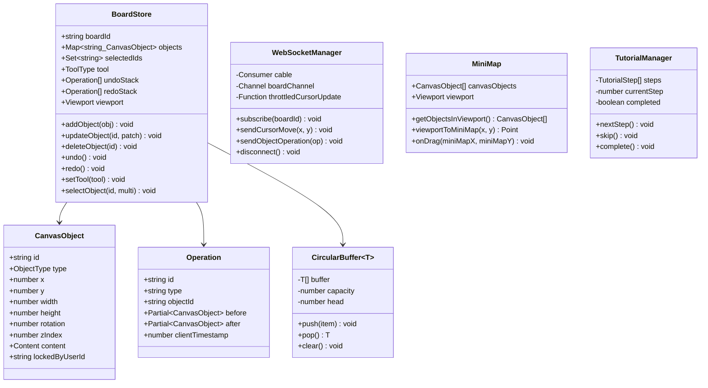
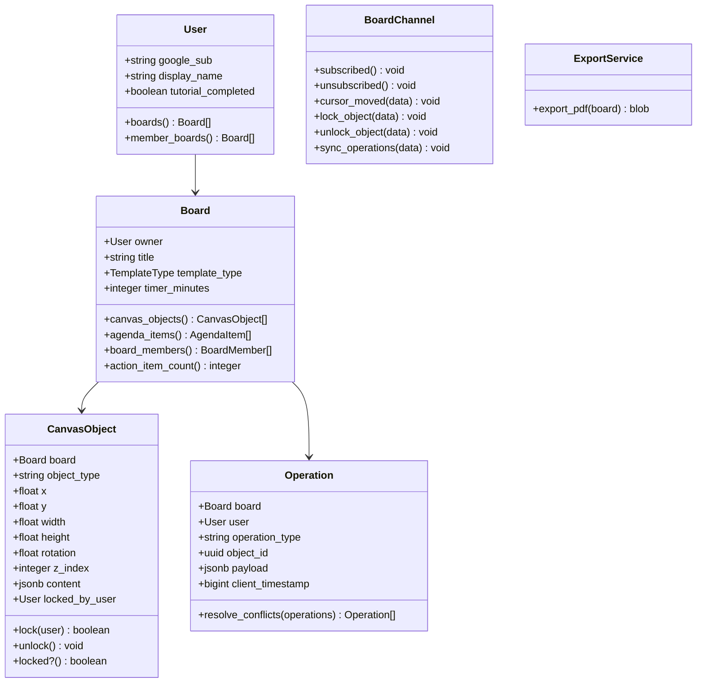

# クラス図

## フロントエンド（TypeScript）

```mermaid
classDiagram
    class BoardStore {
        +string boardId
        +Map~string_CanvasObject~ objects
        +Set~string~ selectedIds
        +ToolType tool
        +Operation[] undoStack
        +Operation[] redoStack
        +Viewport viewport
        +addObject(obj) void
        +updateObject(id, patch) void
        +deleteObject(id) void
        +undo() void
        +redo() void
        +setTool(tool) void
        +selectObject(id, multi) void
    }

    class CanvasObject {
        +string id
        +ObjectType type
        +number x
        +number y
        +number width
        +number height
        +number rotation
        +number zIndex
        +Content content
        +string lockedByUserId
    }

    class Operation {
        +string id
        +string type
        +string objectId
        +Partial~CanvasObject~ before
        +Partial~CanvasObject~ after
        +number clientTimestamp
    }

    class CircularBuffer~T~ {
        -T[] buffer
        -number capacity
        -number head
        +push(item) void
        +pop() T
        +clear() void
    }

    class WebSocketManager {
        -Consumer cable
        -Channel boardChannel
        -Function throttledCursorUpdate
        +subscribe(boardId) void
        +sendCursorMove(x, y) void
        +sendObjectOperation(op) void
        +disconnect() void
    }

    class MiniMap {
        +CanvasObject[] canvasObjects
        +Viewport viewport
        +getObjectsInViewport() CanvasObject[]
        +viewportToMiniMap(x, y) Point
        +onDrag(miniMapX, miniMapY) void
    }

    class TutorialManager {
        -TutorialStep[] steps
        -number currentStep
        -boolean completed
        +nextStep() void
        +skip() void
        +complete() void
    }

    BoardStore --> CanvasObject
    BoardStore --> Operation
    BoardStore --> CircularBuffer
```

## バックエンド（Ruby on Rails）

```mermaid
classDiagram
    class User {
        +string google_sub
        +string display_name
        +boolean tutorial_completed
        +boards() Board[]
        +member_boards() Board[]
    }

    class Board {
        +User owner
        +string title
        +TemplateType template_type
        +integer timer_minutes
        +canvas_objects() CanvasObject[]
        +agenda_items() AgendaItem[]
        +board_members() BoardMember[]
        +action_item_count() integer
    }

    class CanvasObject {
        +Board board
        +string object_type
        +float x
        +float y
        +float width
        +float height
        +float rotation
        +integer z_index
        +jsonb content
        +User locked_by_user
        +lock(user) boolean
        +unlock() void
        +locked?() boolean
    }

    class Operation {
        +Board board
        +User user
        +string operation_type
        +uuid object_id
        +jsonb payload
        +bigint client_timestamp
        +resolve_conflicts(operations) Operation[]
    }

    class BoardChannel {
        +subscribed() void
        +unsubscribed() void
        +cursor_moved(data) void
        +lock_object(data) void
        +unlock_object(data) void
        +sync_operations(data) void
    }

    class ExportService {
        +export_pdf(board) blob
    }

    Board --> CanvasObject
    Board --> Operation
    User --> Board
```
