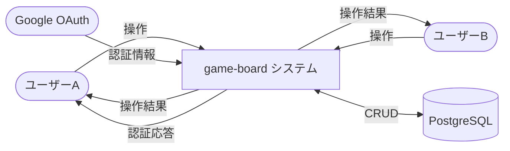
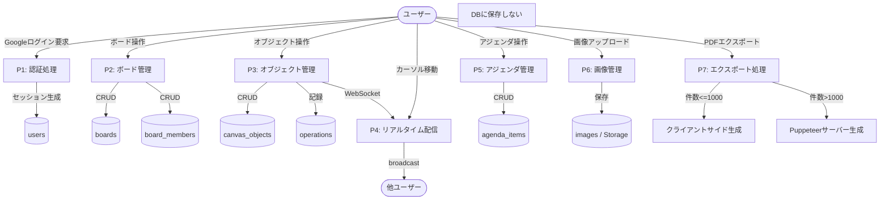

# DFD（データフロー図）

## Level 0 — コンテキスト図

```mermaid
flowchart LR
    UA([ユーザーA]) -->|操作| SYS[game-board システム]
    UB([ユーザーB]) -->|操作| SYS
    GAUTH([Google OAuth]) -->|認証情報| SYS
    SYS -->|操作結果| UA
    SYS -->|操作結果| UB
    SYS -->|認証応答| UA
    SYS <-->|CRUD| DB[(PostgreSQL)]
```

## Level 1 — 主要プロセス

```mermaid
flowchart TD
    U([ユーザー])

    U -->|Googleログイン要求| P1[P1: 認証処理]
    P1 -->|セッション生成| D1[(users)]

    U -->|ボード操作| P2[P2: ボード管理]
    P2 -->|CRUD| D2[(boards)]
    P2 -->|CRUD| D3[(board_members)]

    U -->|オブジェクト操作| P3[P3: オブジェクト管理]
    P3 -->|CRUD| D4[(canvas_objects)]
    P3 -->|記録| D5[(operations)]
    P3 -->|WebSocket| P4[P4: リアルタイム配信]
    P4 -->|broadcast| U2([他ユーザー])

    U -->|カーソル移動| P4
    note1[DBに保存しない]

    U -->|アジェンダ操作| P5[P5: アジェンダ管理]
    P5 -->|CRUD| D6[(agenda_items)]

    U -->|画像アップロード| P6[P6: 画像管理]
    P6 -->|保存| D7[(images / Storage)]

    U -->|PDFエクスポート| P7[P7: エクスポート処理]
    P7 -->|件数<=1000| C1[クライアントサイド生成]
    P7 -->|件数>1000| C2[Puppeteerサーバー生成]
```
