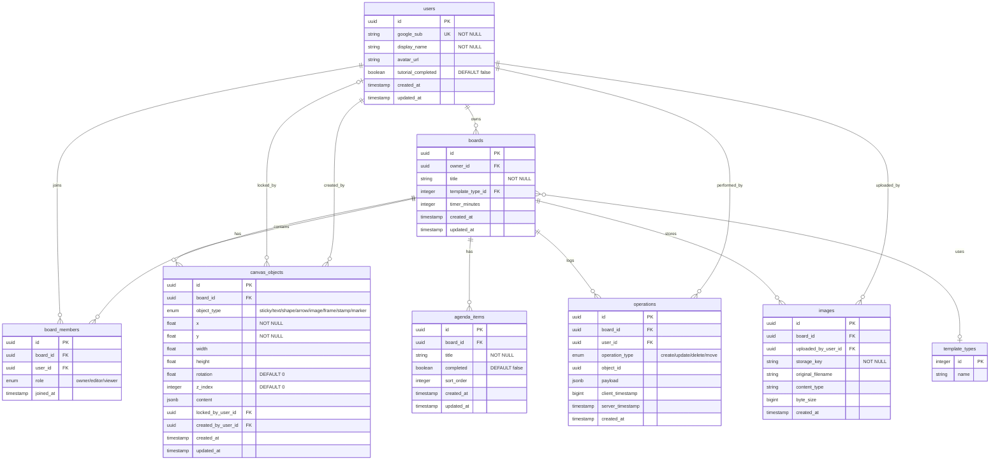

# ER図

## マスタデータ

| マスタ名 | 件数 |
|---|---|
| tool_types | 9件（付箋・テキスト・図形・矢印・画像・フレーム・スタンプ・マーカー・消しゴム） |
| shape_types | 8件（矩形・角丸矩形・円・三角・菱形・六角形・吹き出し・スター） |
| stamp_types | 12件 |
| template_types | 6件（ブレインストーミング・KPT・スプリント計画・ユーザーストーリー・マインドマップ・自由） |
| age_groups | 6件（10代〜60代以上） |
