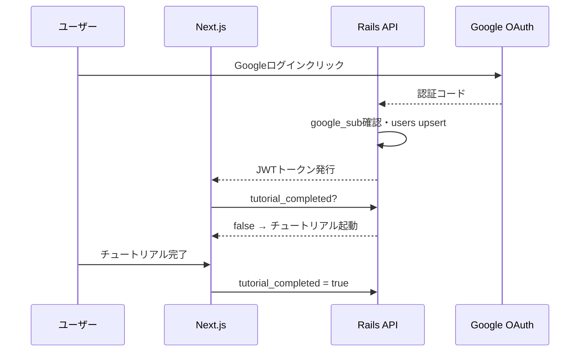
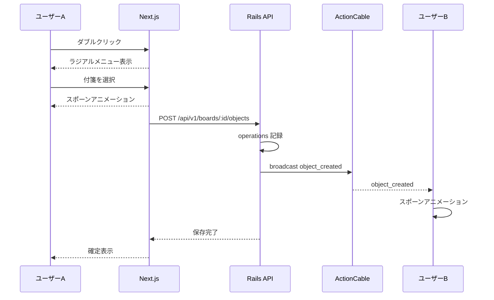
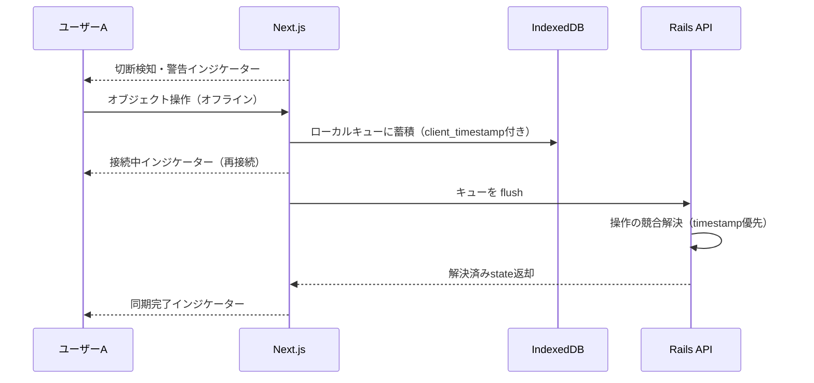
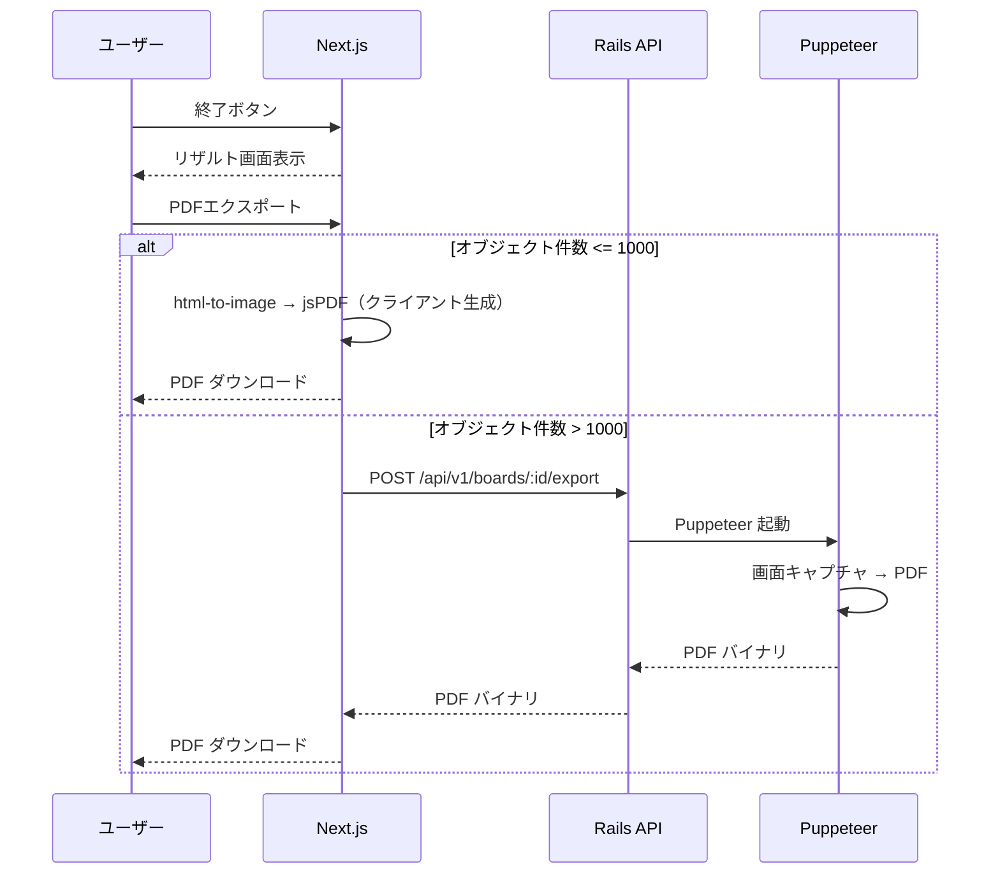

# シーケンス図

## 1. ログイン・初回チュートリアル

```mermaid
sequenceDiagram
    participant U as ユーザー
    participant F as Next.js
    participant R as Rails API
    participant G as Google OAuth

    U->>G: Googleログインクリック
    G-->>R: 認証コード
    R->>R: google_sub確認・users upsert
    R-->>F: JWTトークン発行
    F->>R: tutorial_completed?
    R-->>F: false → チュートリアル起動
    U->>F: チュートリアル完了
    F->>R: tutorial_completed = true
```

## 2. オブジェクト追加（コラボレーション）

```mermaid
sequenceDiagram
    participant UA as ユーザーA
    participant F as Next.js
    participant R as Rails API
    participant AC as ActionCable
    participant UB as ユーザーB

    UA->>F: ダブルクリック
    F-->>UA: ラジアルメニュー表示
    UA->>F: 付箋を選択
    F-->>UA: スポーンアニメーション
    F->>R: POST /api/v1/boards/:id/objects
    R->>R: operations 記録
    R->>AC: broadcast object_created
    AC-->>UB: object_created
    UB->>UB: スポーンアニメーション
    R-->>F: 保存完了
    F-->>UA: 確定表示
```

## 3. オフライン同期

```mermaid
sequenceDiagram
    participant U as ユーザーA
    participant F as Next.js
    participant IDB as IndexedDB
    participant R as Rails API

    F-->>U: 切断検知・警告インジケーター
    U->>F: オブジェクト操作（オフライン）
    F->>IDB: ローカルキューに蓄積（client_timestamp付き）
    F-->>U: 接続中インジケーター（再接続）
    F->>R: キューを flush
    R->>R: 操作の競合解決（timestamp優先）
    R-->>F: 解決済みstate返却
    F-->>U: 同期完了インジケーター
```

## 4. リザルト画面・PDFエクスポート

```mermaid
sequenceDiagram
    participant U as ユーザー
    participant F as Next.js
    participant R as Rails API
    participant P as Puppeteer

    U->>F: 終了ボタン
    F-->>U: リザルト画面表示
    U->>F: PDFエクスポート
    alt オブジェクト件数 <= 1000
        F->>F: html-to-image → jsPDF（クライアント生成）
        F-->>U: PDF ダウンロード
    else オブジェクト件数 > 1000
        F->>R: POST /api/v1/boards/:id/export
        R->>P: Puppeteer 起動
        P->>P: 画面キャプチャ → PDF
        P-->>R: PDF バイナリ
        R-->>F: PDF バイナリ
        F-->>U: PDF ダウンロード
    end
```
