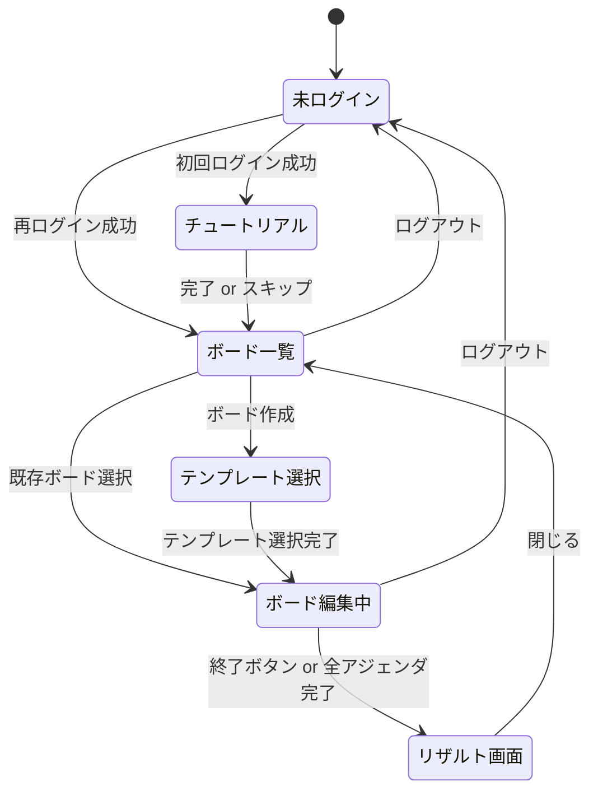
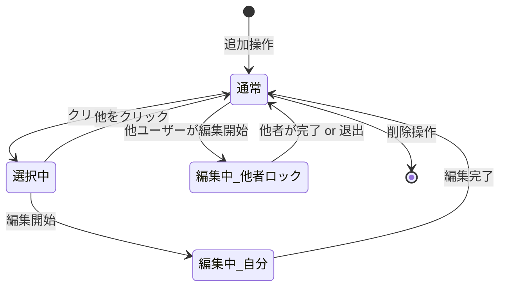
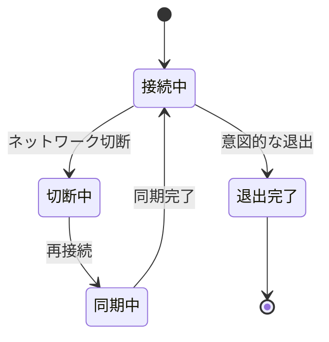
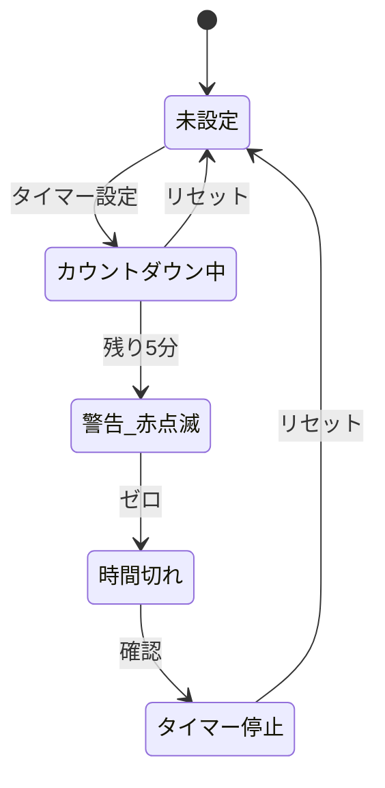

# 状態遷移図

## 1. アプリ全体

```mermaid
stateDiagram-v2
    [*] --> 未ログイン

    未ログイン --> チュートリアル : 初回ログイン成功
    未ログイン --> ボード一覧 : 再ログイン成功

    チュートリアル --> ボード一覧 : 完了 or スキップ

    ボード一覧 --> テンプレート選択 : ボード作成
    ボード一覧 --> ボード編集中 : 既存ボード選択

    テンプレート選択 --> ボード編集中 : テンプレート選択完了

    ボード編集中 --> リザルト画面 : 終了ボタン or 全アジェンダ完了
    リザルト画面 --> ボード一覧 : 閉じる

    ボード一覧 --> 未ログイン : ログアウト
    ボード編集中 --> 未ログイン : ログアウト
```

## 2. オブジェクト状態

```mermaid
stateDiagram-v2
    [*] --> 通常 : 追加操作

    通常 --> 選択中 : クリック
    選択中 --> 通常 : 他をクリック
    選択中 --> 編集中_自分 : 編集開始

    編集中_自分 --> 通常 : 編集完了

    通常 --> 編集中_他者ロック : 他ユーザーが編集開始
    編集中_他者ロック --> 通常 : 他者が完了 or 退出

    通常 --> [*] : 削除操作
```

## 3. 接続状態

```mermaid
stateDiagram-v2
    [*] --> 接続中

    接続中 --> 切断中 : ネットワーク切断
    切断中 --> 同期中 : 再接続
    同期中 --> 接続中 : 同期完了

    接続中 --> 退出完了 : 意図的な退出
    退出完了 --> [*]
```

## 4. セッションタイマー

```mermaid
stateDiagram-v2
    [*] --> 未設定

    未設定 --> カウントダウン中 : タイマー設定

    カウントダウン中 --> 警告_赤点滅 : 残り5分
    警告_赤点滅 --> 時間切れ : ゼロ

    時間切れ --> タイマー停止 : 確認
    タイマー停止 --> 未設定 : リセット

    カウントダウン中 --> 未設定 : リセット
```
