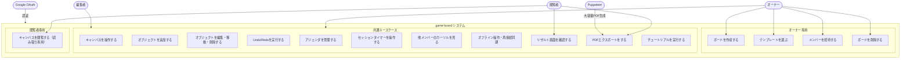

# ユースケース図

```mermaid
flowchart TB
    subgraph SYSTEM[game-board システム]
        subgraph OWNER_UC[オーナー専用]
            UC01[ボードを作成する]
            UC02[テンプレートを選ぶ]
            UC03[メンバーを招待する]
            UC04[ボードを削除する]
        end

        subgraph COMMON_UC[共通ユースケース]
            UC05[キャンバスを操作する]
            UC06[オブジェクトを追加する]
            UC07[オブジェクトを編集・移動・削除する]
            UC08[Undo/Redoを実行する]
            UC09[アジェンダを管理する]
            UC10[セッションタイマーを操作する]
            UC11[他メンバーのカーソルを見る]
            UC12[オフライン操作・再接続同期]
            UC13[リザルト画面を確認する]
            UC14[PDFエクスポートをする]
            UC15[チュートリアルを実行する]
        end

        subgraph VIEWER_UC[閲覧者専用]
            UC16[キャンバスを閲覧する（読み取り専用）]
        end
    end

    OWNER([オーナー])
    EDITOR([編集者])
    VIEWER([閲覧者])
    GOOGLE([Google OAuth])
    PUPPETEER([Puppeteer])

    OWNER --> UC01
    OWNER --> UC02
    OWNER --> UC03
    OWNER --> UC04
    OWNER --> COMMON_UC

    EDITOR --> COMMON_UC

    VIEWER --> UC16
    VIEWER --> UC13
    VIEWER --> UC14

    GOOGLE -->|認証| SYSTEM
    PUPPETEER -->|大容量PDF生成| UC14
```
